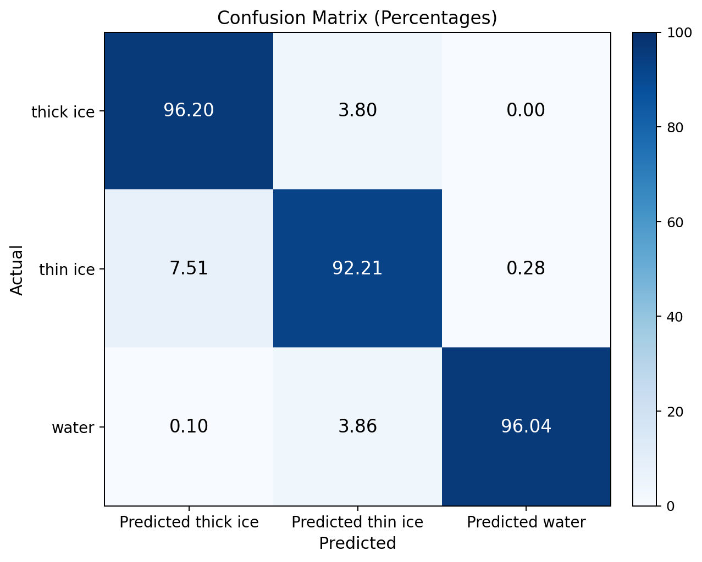

# Sea Ice Classification &mdash; Deep Fusion of Sentinel-2 Imagery and ICESat-2 Photon Data

Per-pixel classification of Antarctic sea ice as **thick ice**, **thin ice**, or **water** by combining Sentinel-2 RGB imagery with ICESat-2 ATL03 photon measurements.

> **Headline result:** Test mIoU **0.9010**, macro-F1 **0.9468**, with per-class diagonals 96 / 92 / 96 on the held-out tile T03CWT.



---

## Why this matters

Sea ice classification from space is normally done with passive optical imagery alone. That works well for the easy classes (open water vs. solid ice), but **thin ice** is hard &mdash; in the visible spectrum it can look almost identical to thick ice, even though the two have very different physical and climatological properties.

ICESat-2's laser altimeter gives sub-decimeter height precision along narrow ground tracks, which carries genuine information about ice thickness. The hard question is: **can we combine the two so the image fills in where the photons are sparse, and the photons disambiguate what the image cannot see?**

This repository contains the code, trained-model artifacts, and write-up for one answer to that question.

---

## TL;DR

Three models on identical splits (train: tiles T02CNA + T02CNC, test: tile T03CWT):

| Model | Input | Test mIoU | IoU thick ice | IoU thin ice | IoU water |
|---|---|---|---|---|---|
| U-Net (image only) | Sentinel-2 RGB | 0.8704 | 0.9299 | 0.7683 | 0.9130 |
| LSTM (photon only) | ATL03 segments | 0.6978 | 0.9671 | 0.5427 | 0.5836 |
| **Deep Fusion (winner)** | both | **0.9010** | **0.9403** | **0.8138** | **0.9489** |

Fusion delivers its biggest gains exactly where the image-only baseline struggles:

* **Thin ice IoU:** 0.768 (U-Net) &rarr; 0.814 (fusion) &mdash; **+4.5 pp**
* **Water IoU:**    0.913 (U-Net) &rarr; 0.949 (fusion) &mdash; **+3.6 pp**

For a fuller writeup with confusion matrices, training curves, and sample predictions, see [`project_summary.pdf`](project_summary.pdf).

---

## Data

| Source | What it provides | Where in repo |
|---|---|---|
| Sentinel-2 L1C tiles | RGB at 10&nbsp;m resolution; cropped to 128&times;128 patches | `S2_tiff/`, `outputs/` (gitignored, ~10&nbsp;GB) |
| ICESat-2 ATL03 photons | along-track height + photon counts, 10&nbsp;m segments | `IS2_Corrected_data/*.csv` |
| Ground-truth masks | per-pixel labels (red = thick ice, blue = thin ice, green = water) | `outputs_segmented/` (gitignored) |

**Tiles used:** `T02CNA`, `T02CNC` (training), `T03CWT` (test, completely held out).

The train/test split is **by tile**, not by random patches, so the test score reflects generalization to a region the model has never seen &mdash; not just adjacent patches from the same scene.

---

## Approach

The repository contains three models. They share the same data loaders, splits, and evaluation code; the only thing that varies is the architecture.

### 1. U-Net &mdash; image only

* ResNet-18 encoder, pretrained on ImageNet, decoder produces per-pixel logits.
* Loss: weighted cross-entropy (class weights inversely proportional to frequency).
* Notebook: see `archive/notebooks/unet_baseline.ipynb`.

### 2. LSTM &mdash; photon CSV only

The ATL03 CSV files are already aggregated to 10-meter along-track segments. For each patch, we take a window of **5 consecutive segments** (center &plusmn; 2) and feed 8 engineered features per segment to a uni-directional LSTM:

| Feature | Meaning |
|---|---|
| `h_cor_mean` | mean corrected photon height |
| `h_cor_med` | median corrected photon height |
| `h_diff = mean - med` | within-segment height asymmetry |
| `rel_height_min_elev` | mean height minus the per-track minimum |
| `height_sd` | std of photon heights |
| `pcnth_mean` | mean photon-count height |
| `pcnt_mean` | mean photon count |
| `bcnt_mean`, `brate_mean` | mean background photon count & rate |

**Architecture** (mirrors the professor&rsquo;s own Keras notebook):

```
uni-LSTM(hidden=96, 1 layer, tanh)
  -> Dropout(0.4)
  -> Dense(16, ELU) -> Dropout(0.4)
  -> Dense(16, ELU) -> Dropout(0.4)
  -> Dense(3, softmax)
```

**Loss:** `CategoricalFocalCrossentropy(alpha=[0.05, 0.45, 0.60], gamma=2.0)`. Focal loss is critical here &mdash; weighted CE alone causes the model to collapse to "predict thick ice everywhere" because ice dominates ~75&nbsp;% of pixels.

**Hyperparameters:** picked by a 21-config sweep over alpha, gamma, hidden size, learning rate, dropout, sequence length and random seed (one axis varied at a time from a baseline). The winner was `hidden=96` &mdash; everything else stayed close to the professor's defaults. See `lstm_sweep.ipynb`.

### 3. Deep Fusion &mdash; image + LSTM (the winner)

```
RGB (B,3,128,128) --> U-Net (ResNet-18) ---------> img_feat (B,16,128,128)
                                                          |
                                                          v
                                            cat --> SE attention --> conv --> logits (B,3,128,128)
                                                          ^
                                                          |
CSV (B,5,8) --> uni-LSTM(96) --> last hidden ---> Dense(96->16,elu) + Dense(16->16,elu)
                                              ---> tile to (B,16,128,128)
```

The two key design choices:

1. **Hot-load the sweep-winner LSTM weights** into the fusion model instead of training the CSV branch from random init. The LSTM has already learned how to discriminate ice vs. thin ice vs. water from its 8 features &mdash; reusing that knowledge avoids re-learning it inside the more complex joint optimization.
2. **Fine-tune both branches**, but at different learning rates: the pretrained LSTM weights at **0.1&times;** the rest of the network (1e-5 vs 1e-4). This lets the LSTM adapt slightly to the fusion context without overwriting what it learned on the LSTM-only task.

**Squeeze-and-Excitation attention** rescales each of the 32 fused channels (16 image + 16 CSV) before the final 3&times;3 convolution, letting the model up- or down-weight either modality per sample.

**Loss:** same focal loss as the LSTM-only model. Same train/test split.

The notebook is `fusion_winner.ipynb`; the trained model lives at `runs/fusion_winner/`.

---

## Why fusion helps (the ablation story)

| Variant | mIoU | What changed |
|---|---|---|
| `fusion_v2` (in archive) | 0.802 | uni-LSTM(96), random init, LR=8.9e-4 &rarr; unstable training |
| `fusion_v3` (in archive) | 0.895 | Bi-LSTM(128)x2, random init, LR=1e-4 &rarr; capacity helps |
| `fusion_v4` (in archive) | 0.898 | uni-LSTM(96), **load sweep weights and freeze** &rarr; transfer learning helps |
| `fusion_winner` (root)   | **0.901** | uni-LSTM(96), **load sweep weights, fine-tune @ 0.1&times; LR** &rarr; the +0.003 that pushed us past 0.90 |

Each step adds capability and each step improves the number. The final mIoU of **0.9010** is achieved with the smaller uni-LSTM rather than the bigger Bi-LSTM &mdash; suggesting that **pretrained features matter more than raw capacity** for this task.

---

## Repository layout

```
.
+-- fusion_winner.ipynb        <- the winning model (Deep Fusion)
+-- lstm_sweep.ipynb            <- 21-config LSTM hyperparameter sweep
+-- project_summary.pdf         <- plain-language writeup with figures
+-- methodology_for_friends.pdf <- earlier methodology doc
+-- results_for_friends.pdf
+-- sea_ice_deep_fusion_workflow.pdf
|
+-- runs/
|   +-- fusion_winner/          <- mIoU 0.9010 (the headline model)
|   |   +-- test_metrics.json
|   |   +-- confmat.png
|   |   +-- loss_curve.png
|   |   `-- summary_vs_all.csv
|   +-- lstm_winner/            <- mIoU 0.6978 (sweep winner, hidden=96)
|       +-- test_metrics.json
|       +-- confmat.png
|       `-- metrics.csv
|
+-- archive/                    <- everything we tried that did NOT win
|   +-- notebooks/              <- old fusion versions, alt LSTMs, etc.
|   +-- runs/                   <- per-run metrics for each archived experiment
|   `-- misc/
|
+-- IS2_Corrected_data/         <- ICESat-2 ATL03 photon CSVs (input)
+-- S2_tiff/                    <- Sentinel-2 GeoTIFFs (gitignored; large)
+-- outputs/                    <- cropped 128x128 RGB patches (gitignored)
+-- outputs_segmented/          <- ground-truth masks (gitignored)
+-- papers/                     <- reference PDFs
|
+-- crop_all.py, crop_csv.py, crop_one_point.py   <- patch preparation
`-- segment_all.py, segment_one.py                <- mask generation
```

What lives **only locally** (gitignored): raw and processed datasets, model checkpoints (`*.pt`), per-run normalization caches, and the build scripts (`make_*.py`) that regenerate the notebooks/PDFs.

---

## Reproducing the results

1. **Prepare the data**: `IS2_Corrected_data/` should contain the six ATL03 CSV files (gt1r and gt2r beams for each of the three tiles). Sentinel-2 tiffs go in `S2_tiff/`. Run `crop_all.py` then `segment_all.py` to generate the 128&times;128 patches and masks under `outputs/` and `outputs_segmented/`.

2. **Train the LSTM (or load the sweep winner)**: open `lstm_sweep.ipynb` and run all cells. This produces the 21-config sweep, with the winner (`hidden_96`) used downstream.

3. **Train the fusion model**: open `fusion_winner.ipynb` and run all cells. It will hot-load `runs/lstm_sweep/hidden_96/best.pt` (which the sweep notebook produced), fine-tune at 0.1&times; LR, and write its outputs to `runs/fusion_winner/`.

A GPU with ~10&nbsp;GB of memory is sufficient. We trained on an NVIDIA RTX A6000; one fusion training run takes &sim;60&ndash;90 min for 30 epochs.

---

## Citation & acknowledgments

* **Course:** Research Seminar, Knox College.
* **ICESat-2** photon products from NASA NSIDC.
* **Sentinel-2** imagery from ESA Copernicus.
* The ICESat-2 ATL03 preprocessing follows the professor's reference notebook (`notebook_output/3_ATL03_prepare_data_LSTM_training_2025_cor_label (1).ipynb`).

If you build on this work, please cite the corresponding paper (in preparation).

---

## Status

| Step | Status |
|---|---|
| Data preparation | done |
| U-Net baseline | done |
| LSTM hyperparameter sweep (21 configs) | done |
| Deep fusion training + ablations (v2&ndash;v5) | done |
| Final winner: hot-loaded + fine-tuned fusion model | done |
| Project summary PDF | in `project_summary.pdf` |
| Paper writeup | in preparation |

For the per-class precision / recall / F1 breakdown, training curves, and sample predictions, open [`project_summary.pdf`](project_summary.pdf).
