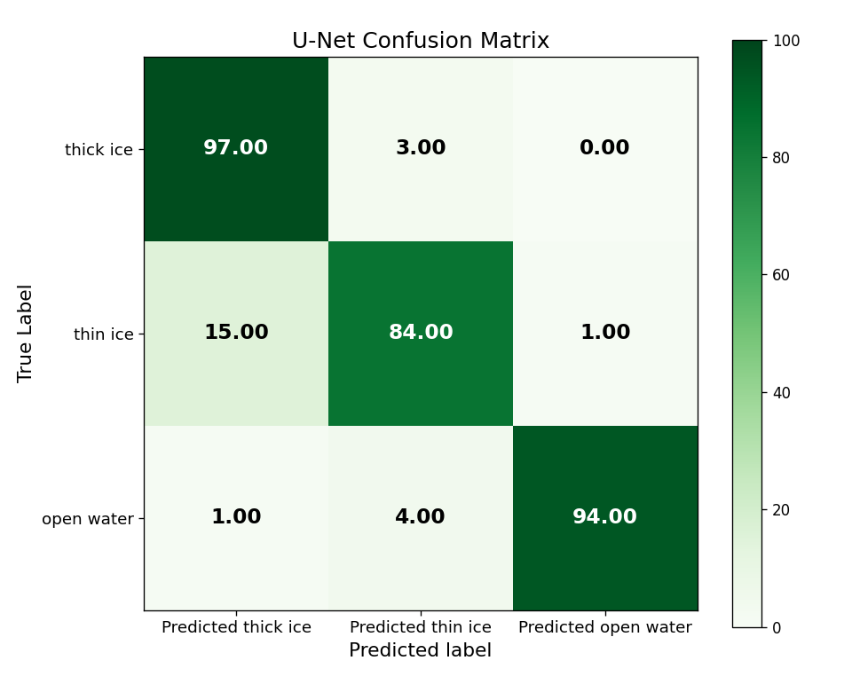
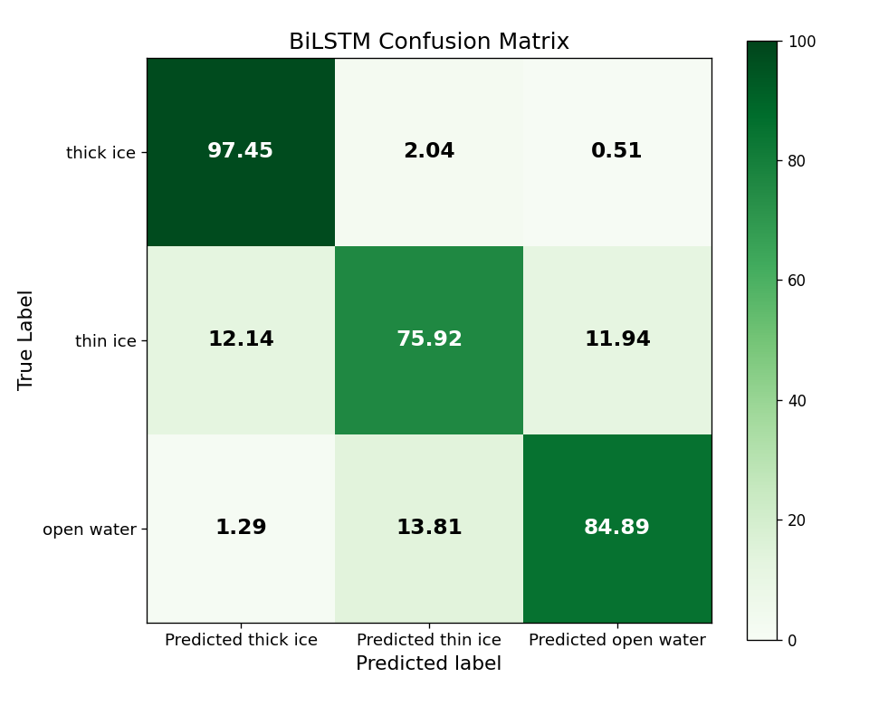
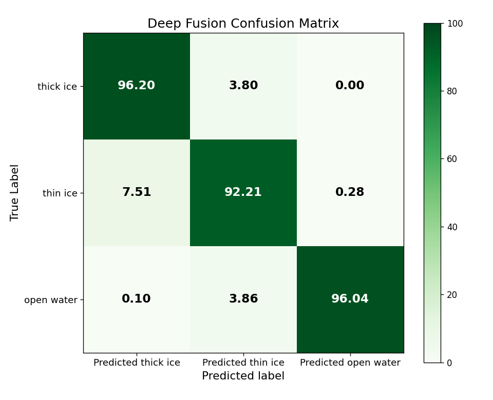
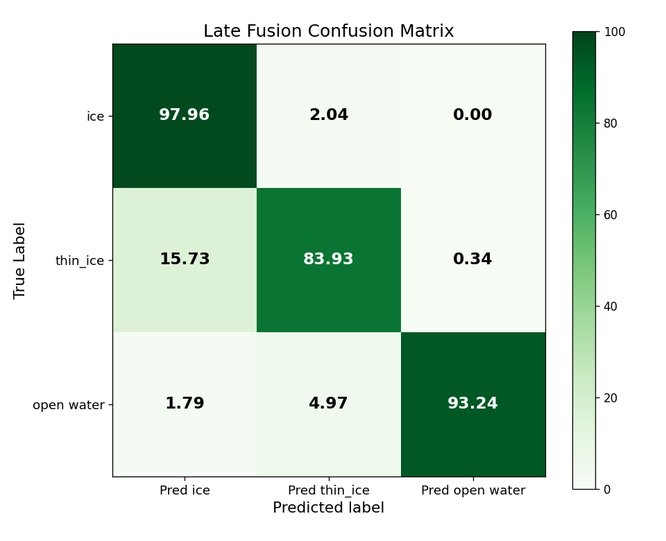
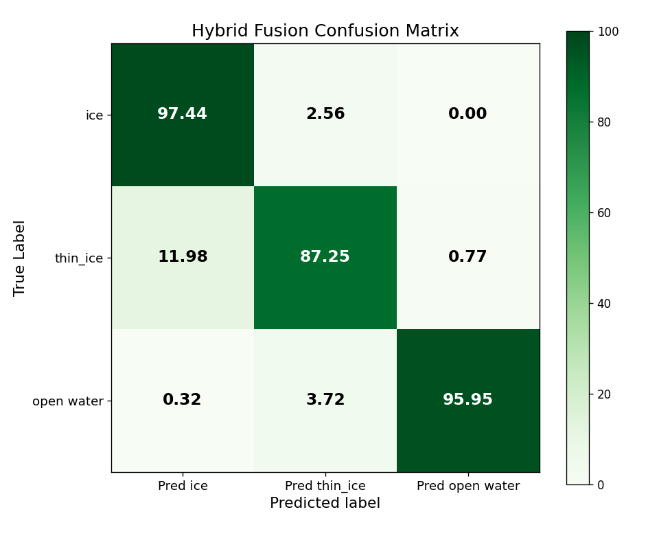

# Multimodal Fusion Strategies for Antarctic Sea Ice Classification

This repository contains the source code, trained-model artifacts, and documentation for a multimodal deep-learning framework that performs per-pixel classification of Antarctic sea ice into three classes (**thick ice**, **thin ice**, and **open water**) by fusing Sentinel-2 optical imagery with ICESat-2 ATL03 photon-altimetry data.

Three fusion strategies are evaluated: **Late Fusion**, **Hybrid Fusion**, and **Deep Fusion**. Each integrates the two modalities at a different level of abstraction. Deep feature-level fusion achieves the best result, attaining a mean Intersection-over-Union (mIoU) of **0.9010** and a macro-averaged F1 score of **0.9468** on a geographically held-out test tile (T03CWT), improving over both unimodal baselines and the other two fusion approaches.

<table align="center">
  <tr>
    <td align="center">
      
      <br/><b>(a) U-Net</b>
    </td>
    <td align="center">
      
      <br/><b>(b) BiLSTM</b>
    </td>
  </tr>
</table>

*Fig. 1: Row-normalized confusion matrices for the two unimodal baseline models evaluated on the geographically held-out tile T03CWT.*

<table align="center">
  <tr>
    <td align="center">
      
      <br/><b>(a) Deep Fusion</b>
    </td>
    <td align="center">
      
      <br/><b>(b) Late Fusion</b>
    </td>
    <td align="center">
      
      <br/><b>(c) Hybrid Fusion</b>
    </td>
  </tr>
</table>

*Fig. 2: Row-normalized confusion matrices for the three multimodal fusion strategies evaluated on the geographically held-out tile T03CWT.*

---

## Key Results

All models are trained on tiles T02CNA and T02CNC and evaluated on the geographically separated tile T03CWT. The split is performed by tile rather than by random patches, providing a strict test of geographic generalization.

| Model | Input Modality | Test mIoU | IoU (Thick Ice) | IoU (Thin Ice) | IoU (Open Water) | Macro F1 |
|:--|:--|:--:|:--:|:--:|:--:|:--:|
| U-Net | Sentinel-2 optical | 0.8704 | 0.9299 | 0.7683 | 0.9130 | N/A |
| BiLSTM | ICESat-2 photon | 0.6978 | 0.9671 | 0.5427 | 0.5836 | 0.8080 |
| Late Fusion | optical + photon | 0.8770 | 0.9334 | 0.7785 | 0.9189 | 0.9329 |
| Hybrid Fusion | optical + photon | 0.8891 | 0.9396 | 0.7988 | 0.9290 | 0.9401 |
| **Deep Fusion** | **optical + photon** | **0.9010** | **0.9403** | **0.8138** | **0.9489** | **0.9468** |

Deep Fusion yields the largest gains on thin ice (+4.5 pp over U-Net) and water (+3.6 pp), the two minority classes for which the image-only baseline is weakest. Hybrid Fusion ranks second and Late Fusion third, both still surpassing all unimodal baselines.

A detailed report with per-class precision/recall/F1, confusion matrices, training curves, and sample predictions is provided in [`project_summary.pdf`](project_summary.pdf).

---

## Fusion Strategy Comparison

### Architectures

All three strategies share the same two modality-specific branches (a U-Net image branch and a recurrent photon branch) but differ in **where and how** their representations are combined.

| Strategy | Integration Level | Mechanism |
|:--|:--|:--|
| Late Fusion | Decision level | Softmax predictions from each branch are averaged pixel-wise |
| Hybrid Fusion | Feature + Decision level | Intermediate U-Net features are concatenated with photon embeddings; a second prediction head is also averaged at the decision level |
| Deep Fusion | Deep feature level | The photon embedding is projected to 16 channels, broadcast spatially, concatenated with the U-Net decoder feature map, recalibrated by a Squeeze-and-Excitation block, and classified by a 1×1 convolution |

### Performance Analysis

**Late Fusion (mIoU 0.8770)** is the most modular approach: each branch is trained and evaluated independently, and their outputs are combined only at inference time. While straightforward to implement and debug, late fusion cannot capture cross-modal feature interactions; the two branches remain "unaware" of each other during training and during intermediate computations. This limits its ability to learn complementary representations.

**Hybrid Fusion (mIoU 0.8891)** improves on late fusion by introducing a mid-network fusion path: photon embeddings are injected into the U-Net decoder at an intermediate spatial scale, allowing the image branch to condition its feature extraction on photon cues. The retained decision-level averaging provides a regularization effect. The result is a +1.2 pp mIoU gain over late fusion, with the largest improvement in thin-ice IoU (+2.0 pp).

**Deep Fusion (mIoU 0.9010)** achieves the best result by fusing modalities entirely at the deep feature level and removing the late-fusion averaging path. Broadcasting the photon feature vector across the full 128×128 spatial grid allows every pixel to be informed by the along-track altimetry reading. The Squeeze-and-Excitation recalibration then selectively amplifies photon-consistent channels. Fine-tuning the pretrained photon branch at one-tenth the base learning rate within the fusion model allows the branch to adapt to the fusion context while retaining transferred representations.

### Per-Class Breakdown

| Class | U-Net | BiLSTM | Late Fusion | Hybrid Fusion | Deep Fusion |
|:--|:--:|:--:|:--:|:--:|:--:|
| Thick ice IoU | 0.9299 | 0.9671 | 0.9334 | 0.9396 | **0.9403** |
| Thin ice IoU  | 0.7683 | 0.5427 | 0.7785 | 0.7988 | **0.8138** |
| Open Water IoU | 0.9130 | 0.5836 | 0.9189 | 0.9290 | **0.9489** |

Thin ice is the most challenging class across all models; deep fusion's photon-informed recalibration is most beneficial there (+4.5 pp over U-Net).

### Key Takeaways

- **Feature-level fusion outperforms decision-level fusion**: Combining modalities before the final classifier consistently improves performance.
- **Spatial broadcast of photon features is effective**: Broadcasting the per-point photon embedding over the full spatial grid allows altimetry to inform every pixel, not just photon-footprint pixels.
- **Pretrained-and-fine-tuned photon branch beats frozen or random initialization**: Transferred representations from standalone LSTM training provide a better starting point than random weights, even with a smaller model capacity.
- **All fusion strategies outperform both unimodal baselines**: Even the weakest fusion variant (late fusion) surpasses the U-Net optical baseline in mIoU.

---

## Repository Structure

```
.
├── deep_fusion.ipynb                  Deep-fusion model (primary result)
├── fusion_late_unet.ipynb             Late-fusion model
├── fusion_hybrid_unet.ipynb           Hybrid-fusion model
├── lstm_sweep.ipynb                   21-configuration LSTM hyperparameter sweep
├── requirements.txt                   Python dependencies
├── project_summary.pdf                Technical report with figures
├── results_summary_public.pdf         Public summary
│
├── crop_all.py, crop_csv.py, crop_one_point.py    Patch extraction
├── segment_all.py, segment_one.py                 Ground-truth mask generation
│
├── confusion_matrices/                Row-normalized confusion matrices (green + blue colormaps)
│   ├── deepfusion_green.png / deepfusion_blue.png
│   ├── latefusion_green.png  / latefusion_blue.png
│   ├── hybridfusion_green.png / hybridfusion_blue.png
│   ├── unet_green.png        / unet_blue.png
│   ├── lstm_green.png        / lstm_blue.png
│   └── README.md
│
├── runs/
│   ├── deep_fusion/                   Deep-fusion outputs (mIoU 0.9010)
│   │   ├── test_metrics.json
│   │   ├── confmat.png
│   │   ├── loss_curve.png
│   │   └── summary_vs_all.csv
│   └── bilstm/                        Photon-only BiLSTM outputs (mIoU 0.6978)
│       ├── test_metrics.json
│       ├── confmat.png
│       └── metrics.csv
│
├── archive/                           Superseded experiments
│   ├── notebooks/                     Earlier fusion variants and baselines
│   └── runs/                          Per-run metrics for archived experiments
│
├── notebook_output/                   Auxiliary notebook outputs
│   └── atl03_lstm_data_preparation_2025.ipynb
│
├── IS2_Corrected_data/                ICESat-2 ATL03 photon CSV files (input)
├── S2_tiff/                           Sentinel-2 GeoTIFF scenes (large; not tracked)
├── outputs/                           Extracted 128×128 RGB patches (not tracked)
├── outputs_segmented/                 Ground-truth segmentation masks (not tracked)
└── papers/                            Reference literature
```

Large datasets, model checkpoints (`*.pt`), and intermediate caches are excluded from version control via `.gitignore` and must be regenerated or supplied locally.

---

## Requirements

- Python 3.9 or later
- A CUDA-capable GPU with at least 10 GB of memory (the reported experiments used an NVIDIA RTX A6000)
- The Python packages listed in [`requirements.txt`](requirements.txt):

```
torch
torchvision
segmentation-models-pytorch
numpy
pandas
pillow
matplotlib
scikit-learn
tqdm
jupyter
nbconvert
```

---

## Installation

```bash
# 1. Clone the repository
git clone https://github.com/Santoshpant23/research-seminar.git
cd research-seminar

# 2. (Recommended) Create and activate a virtual environment
python -m venv .venv
source .venv/bin/activate        # On Windows: .venv\Scripts\activate

# 3. Install dependencies
pip install -r requirements.txt
```

For GPU acceleration, install the build of PyTorch that matches your CUDA version, following the official instructions at https://pytorch.org/get-started/locally/.

---

## Usage

The pipeline runs in three stages: data preparation, photon-branch training, and fusion-model training. Each notebook defines its input and output paths in a configuration cell near the top; adjust these to match your environment before execution.

### 1. Prepare the dataset

Place the ICESat-2 ATL03 photon CSV files in `IS2_Corrected_data/` and the Sentinel-2 GeoTIFF scenes in `S2_tiff/`, then extract aligned image patches and generate the corresponding segmentation masks:

```bash
python crop_all.py          # extract 128x128 RGB patches centered on labeled points
python segment_all.py       # generate per-pixel ground-truth masks
```

This produces the paired patches and masks under `outputs/` and `outputs_segmented/`.

### 2. Train the photon-only BiLSTM

Execute the hyperparameter sweep, which trains the recurrent photon branch and selects the best configuration:

```bash
jupyter nbconvert --to notebook --execute lstm_sweep.ipynb
```

Alternatively, open `lstm_sweep.ipynb` in Jupyter and run all cells interactively. The selected configuration and its checkpoint are written under `runs/`.

### 3. Train the fusion models

Execute any of the three fusion notebooks to train and evaluate that strategy:

```bash
# Deep Fusion (best result)
jupyter nbconvert --to notebook --execute deep_fusion.ipynb

# Late Fusion
jupyter nbconvert --to notebook --execute fusion_late_unet.ipynb

# Hybrid Fusion
jupyter nbconvert --to notebook --execute fusion_hybrid_unet.ipynb
```

Outputs (confusion matrices, loss curves, metrics) are written to the respective `runs/` subdirectory. The final per-class metrics are recorded in `test_metrics.json`.

> **Note.** The notebooks are configured to use a single GPU. Set the device with the `CUDA_VISIBLE_DEVICES` environment variable (for example, `CUDA_VISIBLE_DEVICES=0`) before launching. One fusion training run of 30 epochs requires approximately 60–90 minutes on an RTX A6000.

---

## Methodology

The framework comprises two modality-specific branches whose representations are integrated through one of three fusion strategies.

### Image Branch (U-Net)

Each 128×128 RGB patch is processed by a U-Net with a ResNet-18 encoder pretrained on ImageNet. The decoder restores the original spatial resolution and produces a 16-channel feature map of shape (16, 128, 128).

### Photon Branch (BiLSTM)

The ATL03 records are aggregated into 10-meter along-track segments. For each labeled location, a sliding window of five consecutive segments (the center segment and two neighbors on each side) is formed, and eight engineered features are extracted per segment:

| Feature | Description |
|:--|:--|
| `h_cor_mean` | Mean corrected photon height |
| `h_cor_med` | Median corrected photon height |
| `h_diff` | Difference between mean and median height (within-segment asymmetry) |
| `rel_height_min_elev` | Mean height relative to the per-track minimum |
| `height_sd` | Standard deviation of photon heights |
| `pcnth_mean` | Mean photon-count height |
| `pcnt_mean` | Mean photon count |
| `bcnt_mean`, `brate_mean` | Mean background photon count and background rate |

The sequence is processed by a single-layer recurrent network (hidden dimension 96, dropout 0.4) followed by fully connected layers and a softmax classification head. The branch is trained with categorical focal loss (alpha = [0.05, 0.45, 0.60], gamma = 2.0), which prevents the model from collapsing onto the dominant thick-ice class. The configuration was selected by a 21-run sweep over the loss weights, gamma, hidden dimension, learning rate, dropout, sequence length, and random seed.

### Fusion Stage

Refer to the [Fusion Strategy Comparison](#fusion-strategy-comparison) section above for per-strategy details. In all cases the pretrained photon branch is fine-tuned within the fusion model at one-tenth of the base learning rate, allowing it to adapt to the fusion context while retaining the representations learned during standalone training.

---

## Ablation Study

The following variants quantify the contribution of each design decision in the Deep Fusion model. All are evaluated on the held-out tile T03CWT.

| Variant | mIoU | Configuration |
|:--|:--:|:--|
| `fusion_v2` | 0.8020 | Photon branch trained from random initialization (unstable) |
| `fusion_v3` | 0.8949 | Higher-capacity recurrent branch, random initialization |
| `fusion_v4` | 0.8982 | Pretrained photon branch, frozen during fusion training |
| **`deep_fusion`** | **0.9010** | Pretrained photon branch, fine-tuned at 0.1× learning rate |

The strongest result is obtained with the smaller pretrained-and-fine-tuned recurrent branch rather than the larger randomly initialized one, indicating that transferred representations contribute more than additional model capacity for this task. The archived variants and their metrics are available under `archive/`.

---

## Dataset

| Source | Description |
|:--|:--|
| Sentinel-2 Level-1C | Optical RGB imagery at 10-meter resolution over the Ross Sea region |
| ICESat-2 ATL03 | Geolocated photon point clouds aggregated to 10-meter along-track segments |
| Ground-truth masks | Per-pixel labels generated by an HSV color-thresholding pipeline with cloud and shadow removal |

Class encoding in the masks: red = thick ice, blue = thin ice, green = open water.

---

## Citation and Acknowledgments

This work was conducted as part of the Research Seminar at Knox College. We thank Prof. Iqrah for guidance throughout the project.

- ICESat-2 ATL03 products: NASA National Snow and Ice Data Center (NSIDC)
- Sentinel-2 imagery: ESA Copernicus Programme

A corresponding manuscript is in preparation. Please cite that work if you build upon this repository.

---

## Future Directions

### 1. SAR Modality Integration

The current framework relies on Sentinel-2 optical imagery, which is unavailable under cloud cover, a frequent occurrence over polar regions. A natural next step is to incorporate Sentinel-1 C-band synthetic aperture radar (SAR) backscatter as a third input modality. Unlike optical sensors, SAR penetrates clouds and operates independently of solar illumination, making it well-suited for year-round polar monitoring. At the architecture level, SAR features could be introduced through a third branch analogous to the photon branch, with its output projected and fused at the feature-concatenation stage alongside the U-Net and LSTM representations. Because SAR backscatter encodes surface roughness and dielectric properties, it carries complementary ice-structural information that may help resolve thin-ice and nilas categories that are spectrally ambiguous in optical bands.

### 2. Temporal Sequence Modeling

The current model treats each 128×128 patch as an independent snapshot, discarding the temporal context available from repeat satellite passes. Sentinel-2 revisits the same tile every five days and ICESat-2 follows a 91-day repeat cycle, making multi-date fusion a tractable extension. A temporal model could stack patches from several consecutive overpasses as additional input channels to the U-Net, or apply a convolutional LSTM across the time dimension to propagate spatial-temporal hidden states. This would allow the model to distinguish between ice classes that look similar in a single image but evolve differently over days or weeks. Beyond classification accuracy, temporal modeling opens the door to change-detection outputs: identifying pixels that transition between classes across acquisitions and quantifying the rate and spatial pattern of ice-cover change.

### 3. Geographic Transfer to the Arctic

All training and evaluation in this study used Ross Sea tiles (T02CNA, T02CNC, T03CWT). Antarctic and Arctic sea ice differ substantially in age distribution, surface roughness, melt-pond coverage, and sensor viewing geometry, so out-of-region generalization cannot be assumed. A systematic transfer study would evaluate the trained model in a zero-shot setting on labeled Arctic acquisitions and compare it with models fine-tuned on small Arctic target sets. Successful transfer would establish the framework as a general polar ice-classification tool rather than a region-specific one, increasing its utility for operational agencies that monitor both hemispheres.

---

## Project Status

| Component | Status |
|:--|:--|
| Data preparation pipeline | Complete |
| U-Net optical baseline | Complete |
| BiLSTM photon baseline and hyperparameter sweep | Complete |
| Late-fusion model | Complete |
| Hybrid-fusion model | Complete |
| Deep-fusion model and ablation study | Complete |
| Technical report (`project_summary.pdf`) | Complete |
| Manuscript | In preparation |
